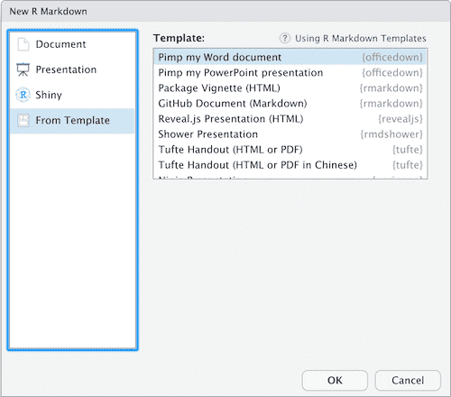
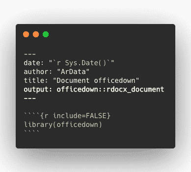
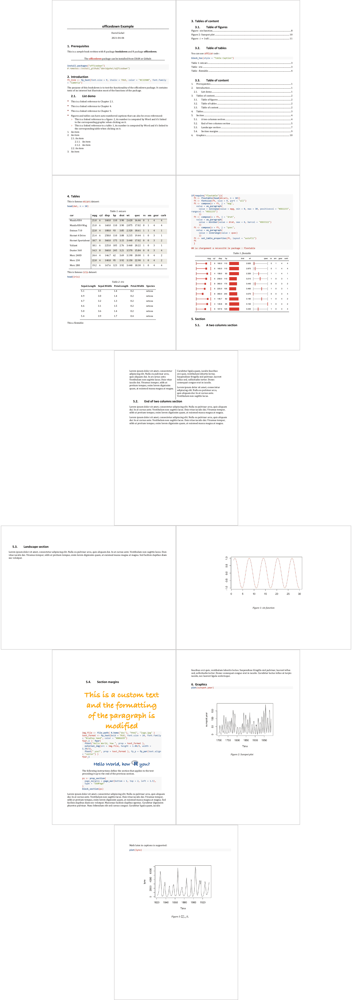

<!-- README.md is generated from README.Rmd. Please edit that file -->

[](https://travis-ci.org/davidgohel/officedown)
[](https://ci.appveyor.com/project/davidgohel/officedown)
[](https://www.tidyverse.org/lifecycle/#experimental)
[](https://cran.r-project.org/package=officedown)


> `{officedown}` is bringing some
> [officer](https://cran.r-project.org/package=officer) features into R
> markdown documents.

## Overview

### Word

The package facilitates the formatting of Microsoft Word documents
produced by R Markdown documents by providing a range of features:

<a href="https://github.com/davidgohel/officedown"></a>

  - Compatibility with the functions of the package `officer` for the
    production of “runs” and “blocks” of content (text formatting,
    landscape mode, tables of contents, etc.).
    
    You can add a column break in a two-column section, you can easily
    color a chunk of text, you can add tables of contents at any place
    in the document and also add a list of figures or list of tables.

  - Ability to use the table styles and list styles defined in the
    “reference\_docx” which serves as a template for the pandoc
    document.
    
    With rmarkdown, you can reuse all paragraph styles. With
    `{officedown}`, you can also reuse table and list styles. These
    features are based on the use of Word templates (`reference_docx`).
    It is recommended to learn how “Word styles” work for paragraphs,
    tables and lists if you never really used Word styles.
    
    > These styles are to be defined in a Word document that serves as a
    > template. You must first create a Word document (or edit an
    > existing Word document), adjust the styles and save it. This
    > document which serves as a vehicle for the defined styles will be
    > used by R Markdown, the argument `reference_docx` must be filled
    > in with the file path.

  - The replacement of captions (tables, figures and standard
    identifiers) by captions containing a Word bookmark that can be used
    for cross-referencing. Also the replacement of cross-references by
    cross-references using fields calculated by Word. The syntax
    conforms to the bookdown cross-reference definition.
    
    The package transforms some specific knitr codes into references
    calculated by Word, it applies to:
    
      - cross-references with bookdown syntax
      - table and image captions
      - title identifiers
    
    > It is then easy to copy and paste the content into another
    > document without losing the reference numbers. Captions are also
    > auto-numbered by Word.

  - Full support for flextable output, including with outputs containing
    images and links.
    
    The package enable knitting flextable outputs with images or plots
    in cells without using `{officer}`. Insertion of images in
    `{flextable}` is not supported with `rmarkdown::word_document` but
    is possible by using `officedown::rdocx_document`.

### PowerPoint

The package also enhances PowerPoint productions with R Markdown by
providing a mechanism for placing results according to the slide
template contained in the PowerPoint document used as “reference\_doc”.
It becomes easy to add several contents in the same slide.

The package also offers the possibility to transform your graphic
instructions into editable vector graphics (with the rvg package) by
simply wrapping your call into a call to function `dml`.

## Ressources

The help pages are in a bookdown located at:

<https://ardata-fr.github.io/officeverse/>

Manuals are available at:

<https://davidgohel.github.io/officedown/>.

## Installation

You can install `{officedown}` from github with:

``` r
remotes::install_github("davidgohel/officedown")
```

Supported formats require some minimum
[pandoc](https://pandoc.org/installing.html) versions:

|    R Markdown output | pandoc version |
| -------------------: | :------------: |
|       Microsoft Word |    \>= 2.0     |
| Microsoft PowerPoint |    \>= 2.4     |

## Getting started

### rdocx\_document

use RStudio Menu to create a document from `{officedown}` template.



It creates an R markdown document, parameter `output` is set to
`officedown::rdocx_document`. Note that package `{officedown}` need to
be loaded in the Rmd.



## Word Features illustration

A bookdown is available in the package and can be used as a demo.

``` r
dir <- system.file(package = "officedown", "examples", "bookdown")
file.copy(dir, getwd(), recursive = TRUE, overwrite = TRUE)
rmarkdown::render_site("bookdown")
browseURL("bookdown/_book/bookdown.docx")
```

You should see the following document:


