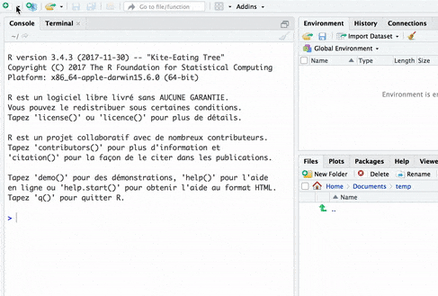

<!-- README.md is generated from README.Rmd. Please edit that file -->

[](https://travis-ci.org/davidgohel/worded)
[](https://ci.appveyor.com/project/davidgohel/worded)
[](https://www.tidyverse.org/lifecycle/#experimental)
[](https://cran.r-project.org/package=worded)

> Pimp your R markdown documents… to produce Word documents.

The package is to be used when you want to use R Markdown documents to
produce Microsoft Word documents but also want options for landscape
orientation, with narrow margins, with formatted text, when some
paragraphs have to be centered.

## Usage

use RStudio Menu to create a document from `worded` template. **It
requires pandoc V2**.



It will create an R markdown document, parameter `output` is to be set
to `worded::rdocx_document`. Also package `worded` need to be loaded.

<pre>
---
date: "2018-03-27"
author: "David Gohel"
title: "Document title"
output: 
  worded::rdocx_document
---

&#96;&#96;&#96;{r setup, include=FALSE}
library(worded)
&#96;&#96;&#96;

...

</pre>

Tags have been made to make less verbose and easier use. Some are
expected parameters (i.e. `CHUNK_TEXT`, `BLOCK_MULTICOL_STOP`). These
parameters need to be defined as inline yaml.

### Chunks

Chunks are to be used in a paragraph in an R markdown
document.

| Output type | Tag name           | R function               | Has args |
| ----------- | ------------------ | ------------------------ | -------- |
| chunk       | CHUNK\_PAGEBREAK   | chunk\_page\_break       | no       |
| chunk       | CHUNK\_TEXT        | chunk\_styled\_text      | yes      |
| chunk       | CHUNK\_TEXT\_STYLE | chunk\_text\_stylenamed  | yes      |
| chunk       | CHUNK\_COLUMNBREAK | chunk\_column\_break     | no       |
| chunk       |                    | add\_paragraph\_settings | yes      |

<pre>This text will be followed by a break page.<!--html_preserve--><span style="color:#7b1b47;">&lt;!---CHUNK_PAGEBREAK---&gt;</span><!--/html_preserve-->

<code>&#96;<!--html_preserve--><span style="color:#7b1b47;">r add_paragraph_settings(align='center', paddings = list(t= 120, b= 20))</span><!--/html_preserve-->&#96;</code>
This paragraph will be centered and wil have a 120 pts top padding and 20 bottom padding.
Text can be styles: <!--html_preserve--><span style="color:#7b1b47;">&lt;!---CHUNK_TEXT{str: 'worded', color: 'orange'}---&gt;</span><!--/html_preserve--> is really cool.
</pre>

### Blocks

Blocks are to be used as a paragraph in an R markdown document.

| Output type | Tag name          | R function        | Has args |
| ----------- | ----------------- | ----------------- | -------- |
| block       | BLOCK\_TOC        | block\_toc        | yes      |
| block       | BLOCK\_POUR\_DOCX | block\_pour\_docx | yes      |

<pre>The following will be transformed as a table of content:

<!--html_preserve--><span style="color:#7b1b47;">&lt;!---BLOCK_TOC---&gt;</span><!--/html_preserve-->

And the following will pour the content of an external docx file into the produced document:

<!--html_preserve--><span style="color:#7b1b47;">&lt;!---BLOCK_POUR_DOCX{docx_file:'path/to/docx'}---&gt;</span><!--/html_preserve--></pre>

### Sections blocks

Section blocks are also blocks but they need to be used in pairs:

  - landscape orientation

| Tag name                | R function                 | Has args |
| ----------------------- | -------------------------- | -------- |
| BLOCK\_LANDSCAPE\_START | block\_section\_continuous | no       |
| BLOCK\_LANDSCAPE\_STOP  | block\_section\_landscape  | no       |

<pre>The following will be in a separated section with landscape orientation

<!--html_preserve--><span style="color:#7b1b47;">&lt;!---BLOCK_LANDSCAPE_START---&gt;</span><!--/html_preserve-->

Blah blah blah.

<!--html_preserve--><span style="color:#7b1b47;">&lt;!---BLOCK_LANDSCAPE_STOP---&gt;</span><!--/html_preserve--></pre>

  - section with columns

| Tag name               | R function                 | Has args |
| ---------------------- | -------------------------- | -------- |
| BLOCK\_MULTICOL\_START | block\_section\_continuous | no       |
| BLOCK\_MULTICOL\_STOP  | block\_section\_columns    | yes      |

<pre>
The following will be in a separated section with 2 columns:

<!--html_preserve--><span style="color:#7b1b47;">&lt;!---BLOCK_MULTICOL_START---&gt;</span><!--/html_preserve-->

Blah blah blah on column 1.

<!--html_preserve--><span style="color:#7b1b47;">&lt;!---CHUNK_COLUMNBREAK---&gt;</span><!--/html_preserve-->
Blah blah blah on column 2.


<!--html_preserve--><span style="color:#7b1b47;">&lt;!---BLOCK_MULTICOL_STOP{widths: [3,3], space: 0.2, sep: true}---&gt;</span><!--/html_preserve-->
</pre>

## Working with flextable

## Installation

You can install worded from github with:

``` r
# install.packages("devtools")
devtools::install_github("davidgohel/worded")
```
