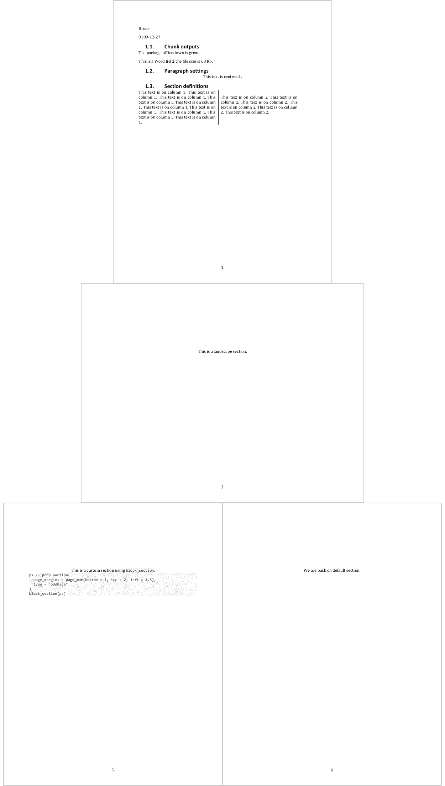
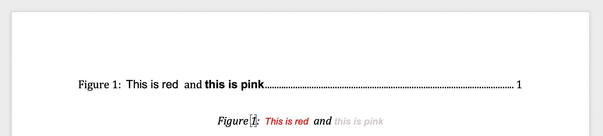

```{r, include = FALSE}
knitr::opts_chunk$set(
  collapse = TRUE,
  comment = "#>"
)
taghl <- function(x){
  structure(list(name = "span", attribs = list(style = "color:#7b1b47;"), 
    children = list(x)), class = "shiny.tag")
}
```

```{css, echo = FALSE}
img {
  width: 85%;
  display: block;
  margin-left: auto;
  margin-right: auto;
  margin-top: 5px;
  margin-bottom: 5px;
}
```

```{r setup}
library(officedown)
library(officer)
```

## Introduction

Package `{officer}` provides functions to produce document *blocks* and *runs*
elements. They can be used in the R Markdown document to produce elements with
formatting not available by default with R Markdown and pandoc:

* add content in a multi-columns section
* add a column break in a multi-columns section
* color a chunk of text
* insert a table of contents at any place in the document (or 
a list of figures or a list of tables)

## Features

```{r echo=FALSE, comment=""}
rmd <- system.file(package = "officedown", "examples", "officer.Rmd")
rmd <- readLines(rmd)
cat(rmd, sep = "\n")
```




## Tags

Tags (as HTML comments) have been designed to be less verbose and easier to use; for landscape pages, 
for multi-columns sections and for tables of contents.

<pre>The following will be transformed as a table of content:

`r taghl("<!---BLOCK_TOC--->")`

And the following will pour the content of an external docx file into the produced document:

`r taghl("<!---BLOCK_POUR_DOCX{file: 'path/to/docx'}--->")`</pre>

> The parameters are defined in a yaml string. Each item in the list is a list of 
key/value pairs defined with `key: value` form (the colon must be followed by a space).


### Sections blocks

Section blocks need to be used in pairs:


**landscape orientation**

| Tag name              | R function               | Has args |
|-----------------------|--------------------------|----------|
| BLOCK_LANDSCAPE_START | block_section_continuous | no       |
| BLOCK_LANDSCAPE_STOP  | block_section_landscape  | no       |

<pre>The following will be in a separated section with landscape orientation

`r taghl("<!---BLOCK_LANDSCAPE_START--->")`

Blah blah blah.

`r taghl("<!---BLOCK_LANDSCAPE_STOP--->")`</pre>


**section with columns**

| Tag name              | R function               | Has args |
|-----------------------|--------------------------|----------|
| BLOCK_MULTICOL_START  | block_section_continuous | no       |
| BLOCK_MULTICOL_STOP   | block_section_columns    | yes      |

<pre>
The following will be in a separated section with 2 columns:

`r taghl("<!---BLOCK_MULTICOL_START--->")`

Blah blah blah on column 1.

`r taghl("<!---CHUNK_COLUMNBREAK--->")`
Blah blah blah on column 2.


`r taghl("<!---BLOCK_MULTICOL_STOP{widths: [3,3], space: 0.2, sep: true}--->")`
</pre>


## Illustrations


### Caption from scratch



