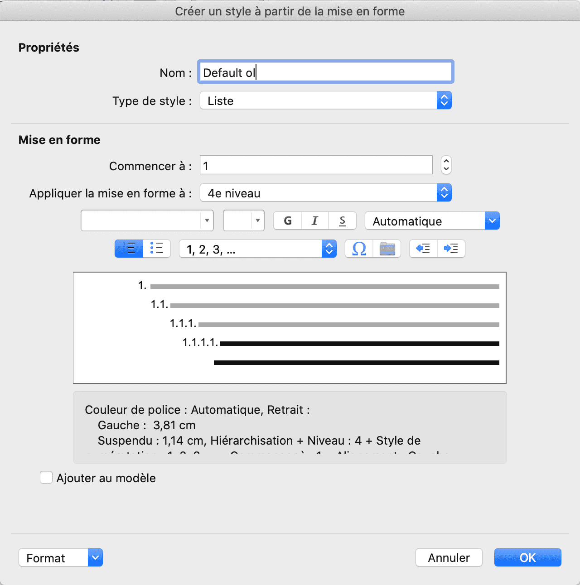

```{r, include = FALSE}
knitr::opts_chunk$set(
  collapse = TRUE,
  comment = "#>"
)
```

```{css, echo = FALSE}
img {
  width: 85%;
  display: block;
  margin-left: auto;
  margin-right: auto;
  margin-top: 5px;
  margin-bottom: 5px;
}
.column2 {
  float: left;
  width: 49%;
  margin: 2px;;
}
.column3 {
  float: left;
  width: 33%;
}

/* Clear floats after the columns */
.row:after {
  content: "";
  display: table;
  clear: both;
}
.medium > p > img {
  width: 50%;
}
.small > p > img {
  width: 30%;
}
```


## reference_docx

The argument `reference_docx` (see `?rmarkdown::word_document`) lets you to use
styles and settings from a template which is a Word document (`*.docx`).

The `R Markdown` documentation on this topic is available via:  
<https://bookdown.org/yihui/rmarkdown/word-document.html>

Taking full advantage of the package's capabilities requires the use of document
templates in which various styles and formatting parameters are stored.

You can create or re-use a Microsoft Word document that will be used as template
(ex: “template.docx”); it will contain the lists definitions, the table styles,
the title and paragraph styles, default fonts and many other settings. 


### Usage

This template will be used as a reference document for the customization of your
list style with R Markdown. To use this feature, specify the `reference_docx`
option in `YAML`.

By default, your YAML header looks like this:  

`````
---
date: "`r Sys.Date()`"
author: "superman"
title: "Document title"
output: 
  officedown::rdocx_document
---
`````

::::: row

::: column2

Add `reference_docx` argument to the `YAML`: 

`````
---
date: "`r Sys.Date()`"
author: "superman"
title: "Document title"
output: 
  officedown::rdocx_document:
     reference_docx: template.docx
---
`````

:::

::: column2

When using `bookdown`, it should be:

`````
---
date: "`r Sys.Date()`"
author: "superman"
title: "Document title"
output: 
  bookdown::markdown_document:
    base_format: "officedown::rdocx_document"
    reference_docx: template.docx
---
`````


:::


:::::


## Default settings

The package is using global settings, used for customization of tables, lists,
plots and captions.

Default values are presented below in their YAML format.

```yaml
# full default yaml header
output: 
  officedown::rdocx_document:
    tables:
      style: Table
      layout: autofit
      width: 1.0
      caption:
        style: Table Caption
        pre: 'Table '
        sep: ': '
      conditional:
        first_row: true
        first_column: false
        last_row: false
        last_column: false
        no_hband: false
        no_vband: true
    plots:
      style: Normal
      align: center
      caption:
        style: Image Caption
        pre: 'Figure '
        sep: ': '
    lists:
      ol.style: null
      ul.style: null
```

Default values are detailled in the help page of `rdocx_document`, see details
with command:

```{r eval=FALSE}
?officedown::rdocx_document
```

There is a mechanism to overwrite the defaults with the specified values. This
makes it possible not to fill in all the arguments. Thus, a header like the
following one is valid:

```yaml
# officedown yaml header
output: 
  officedown::rdocx_document:
    tables:
      caption:
        pre: 'tab. '
```

## How to create styles

### List style

> For a much more detailled explanation, read this article:
> <https://www.howtogeek.com/355561/how-to-create-and-work-with-multilevel-lists-in-microsoft-word/>

To create a list style in your `reference_docx` corresponding to your needs,
edit the document with MS Word and add a new style of type "list".

The style name will be set to "ol.style" argument if you configure an ordered
list (i.e. with numbers corresponding to each level) or to "ul.style" argument
if you configure an unordered list (i.e. with bullets corresponding to each
level).

You should see a window that looks like one of the two below:


::::: row

::: column2



:::

::: column2


:::

:::::

In the Define New List Style window, start give your new style a name ("Default
ol" in the example). There are a many formatting options available in this
window. You can change the font, define the character formatting and choose the
type (number or bullet).

To re-use the new style definition located in `template.docx`, specify
`ol.style` in the yaml header of you R Markdown document:

```yaml
# officedown yaml header
output: 
  officedown::rdocx_document:
    reference_docx: template.docx
    lists:
      ol.style: 'Default ol'
```

### Table style


To create a table style in your `reference_docx` corresponding to your needs,
edit the document with MS Word and add a new style of type "table" then
configure it.

You should see a window that looks like the one below:

::: medium


:::


In the Define New Table Style window, start give your new style a name. There
are a many formatting options available in this window. For example, you can
change the font and font style, change the border and cell colors, and change
the text alignment. Note there's no opption to apply a style to individual
cells, this is a Word limit, [Package
flextable](https://davidgohel.github.io/flextable) is to be used if this is what
you need.


Once you are happy with the style, save the document - the style is stored
within the word document. 


